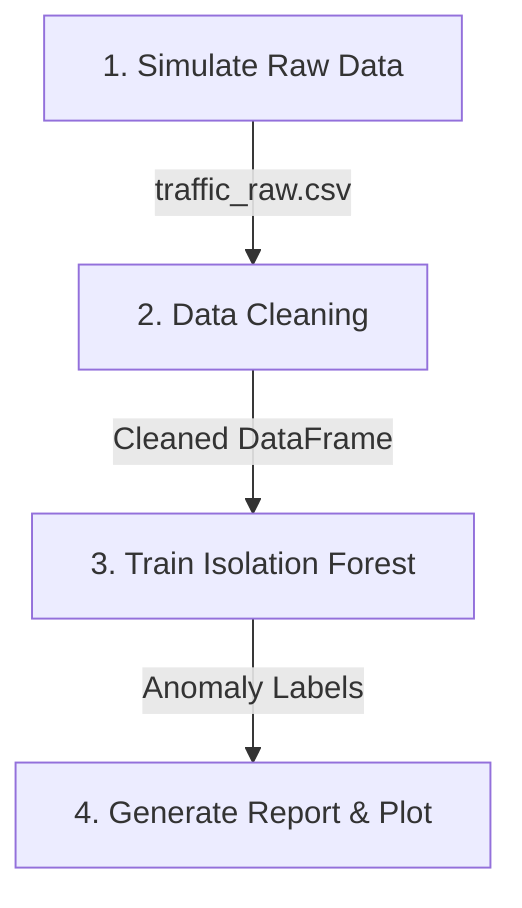

# The Healing Analytics Engine

An end-to-end anomaly detection pipeline built inside Google's Antigravity IDE. It simulates a messy network traffic dataset, cleans it using pandas, trains an unsupervised machine learning model to detect extreme traffic outliers, and exports reports and visualizations.

---

## 📋 Pipeline Workflow

The pipeline performs four key operations sequentially:



1. **Dataset Simulation:**
   - Generates 10,000 rows of traffic data starting from `2026-06-01`.
   - Injects messy timestamp formats (e.g. `DD/MM/YYYY`, prefix `ERR-`, suffix `(UTC)`, and corrupted values).
   - Injects 5% missing values (NaNs) across all columns.
   - Injects extreme outliers (high traffic volume spikes, negative traffic volume, and high response latencies).

2. **Data Cleaning & Imputation:**
   - Standardizes timestamp strings by stripping prefixes/suffixes and parses them.
   - Drops rows with missing or corrupted timestamps.
   - Imputes missing numerical values (`traffic_volume` and `response_time`) using the **median**, which is robust to the injected extreme outliers.

3. **Anomaly Classification:**
   - Trains an **Isolation Forest** model (`contamination=0.05`) to isolate the top 5% extreme multivariate anomalies.

4. **Reporting & Visualizations:**
   - Exports [anomaly_report.md](anomaly_report.md) summarizing cleaning stats and anomaly thresholds.
   - Generates [anomaly_clusters.png](anomaly_clusters.png), a scatter plot highlighting the anomalies in red against normal indigo data.

---

## 🛠️ Repository Structure

```
├── .github/workflows/
│   └── pipeline.yml       # GitHub Actions workflow
├── anomaly_clusters.png   # Matplotlib scatter plot (output)
├── anomaly_pipeline.py    # Main pipeline python script
├── anomaly_report.md      # Markdown report summary (output)
├── pyproject.toml         # Python project configuration & dependencies
├── README.md              # Documentation
├── traffic_raw.csv        # Simulated raw dataset
└── uv.lock                # Locked dependencies file
```

---

## 🚀 Getting Started

This project uses [uv](https://github.com/astral-sh/uv) for fast, reliable dependency and environment management.

### Prerequisites

Install `uv` if you haven't already:
```bash
# On macOS/Linux
curl -LsSf https://astral-sh/uv/install.sh | sh
```

### Local Execution

Clone the repository and run the pipeline:

```bash
# Sync dependencies and run the script
uv run python anomaly_pipeline.py
```

This will automatically:
1. Detect or simulate `traffic_raw.csv`.
2. Run the cleaning, modeling, and plotting routines.
3. Overwrite/update `anomaly_report.md` and `anomaly_clusters.png` in the directory.

---

## 🤖 GitHub Actions Workflow

The repository includes a GitHub Actions configuration in `.github/workflows/pipeline.yml`. On every push or pull request to the `main` branch, the runner will:
- Check out the repository.
- Set up Python and `uv`.
- Execute the pipeline script (`anomaly_pipeline.py`).
- Upload the generated `anomaly_report.md` and `anomaly_clusters.png` as workflow artifacts.
