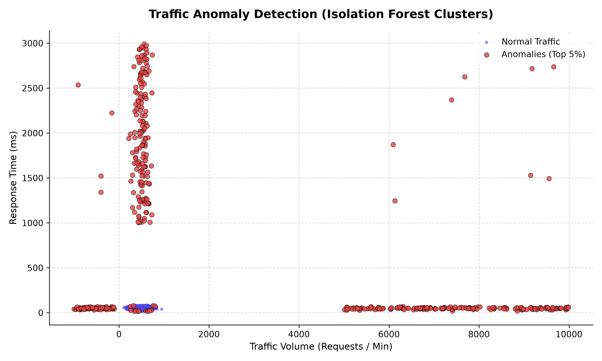

# Anomaly Detection Pipeline Report

## 1. Data Cleaning & Preprocessing Summary

The raw traffic dataset was loaded and cleaned to ensure compatibility with the anomaly detection models. The preprocessing steps performed were:
- **Timestamp Parsing:** Extracted date-times, cleaned malformed formats (e.g., removing prefix `ERR-` and suffix ` (UTC)`), and dropped unparseable entries.
- **Handling Missing Values:** Missing numerical values were imputed using column-wise medians to protect the training process from the influence of extreme simulated outliers.

| Metric | Value |
| :--- | :--- |
| **Original Dataset Rows** | 10,000 |
| **Initial Null Timestamps** | 493 |
| **Initial Null Traffic Volumes** | 487 |
| **Initial Null Response Times** | 495 |
| **Unparseable/Missing Timestamps Dropped** | 1,227 |
| **Imputed Traffic Volume Values** | 422 (using median = 503.58) |
| **Imputed Response Time Values** | 428 (using median = 50.42) |
| **Cleaned Dataset Rows** | 8,773 |

---

## 2. Anomaly Detection Results

We trained an **Isolation Forest** model to detect multivariate anomalies in our network traffic data. To isolate the top 5% extreme behaviors, we configured the model with a `contamination=0.05` hyperparameter.

- **Total Normal Observations:** 8,334 (95.00%)
- **Total Anomalous Observations:** 439 (5.00%)

### Traffic Features Comparison

The table below contrasts the characteristics of normal traffic versus flagged anomalies:

| Feature & Metric | Normal Data | Anomalous Data |
| :--- | :--- | :--- |
| **Traffic Volume (Mean)** | 501.51 | 3139.37 |
| **Traffic Volume (Min / Max)** | 107.76 / 947.91 | -998.32 / 9983.40 |
| **Response Time (Mean)** | 50.15 ms | 802.06 ms |
| **Response Time (Max)** | 84.70 ms | 2991.38 ms |

---

## 3. Visualization

Below is the visualization of the data points and identified anomaly clusters:

